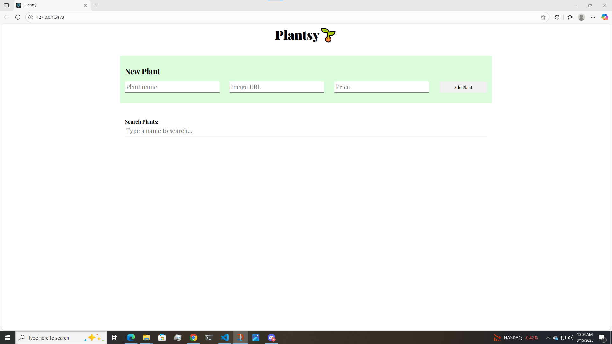

# Plantsy - Plant Store Admin

A React app for managing plant inventory with add, search, and stock management features.



## Setup

1. **Install dependencies**
   ```bash
   npm install
   ```

2. **Start backend server**
   ```bash
   npm run server
   ```

3. **Start the app**
   ```bash
   npm run dev
   ```

4. **Verify setup**
   - Backend: http://localhost:6001/plants
   - Frontend: http://localhost:5173

## Features

- View all plants
- Add new plants via form
- Mark plants as "sold out"
- Search plants by name

## API Endpoints

**GET /plants** - Get all plants
**POST /plants** - Add new plant

Required format:
```json
{
  "name": "string",
  "image": "string",
  "price": "string"
}
```

## Testing

```bash
npm run test
```

## Technologies Used

- React 18 with hooks
- Vite
- JSON Server for backend

---

Built for plant store management 🌱